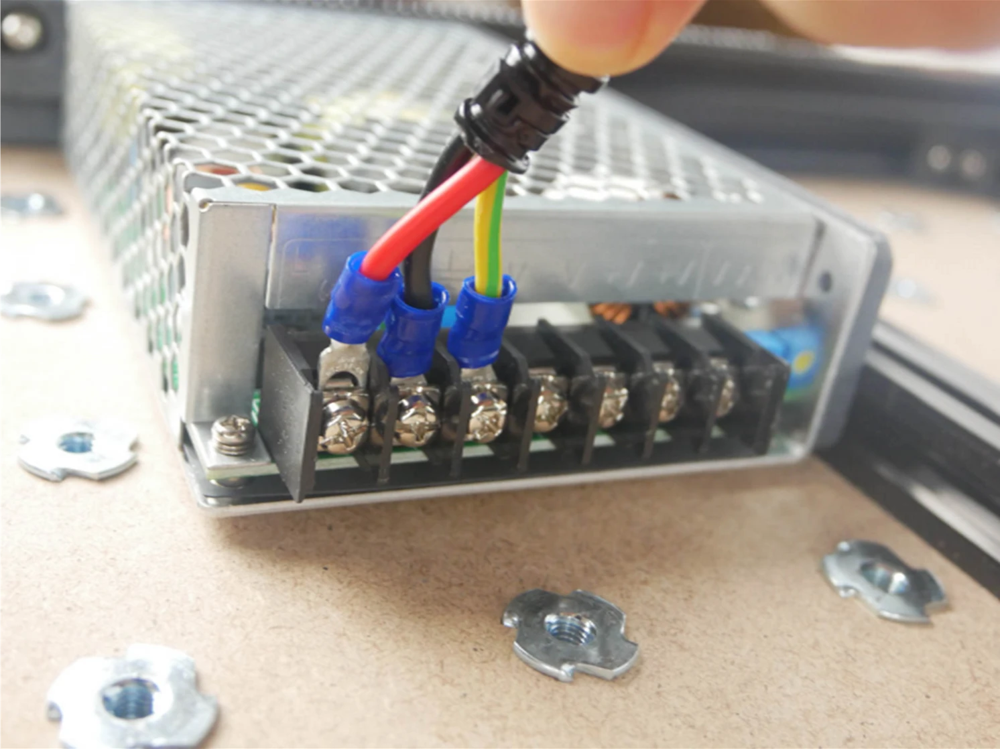
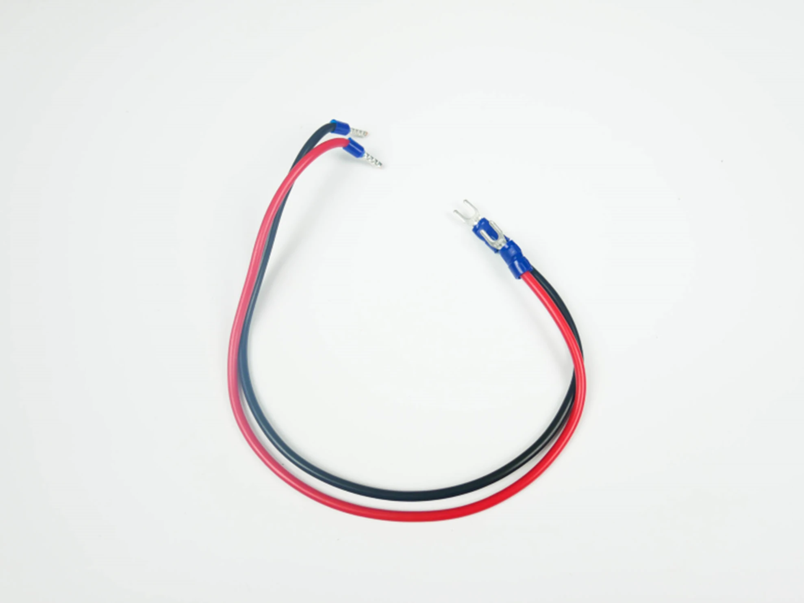
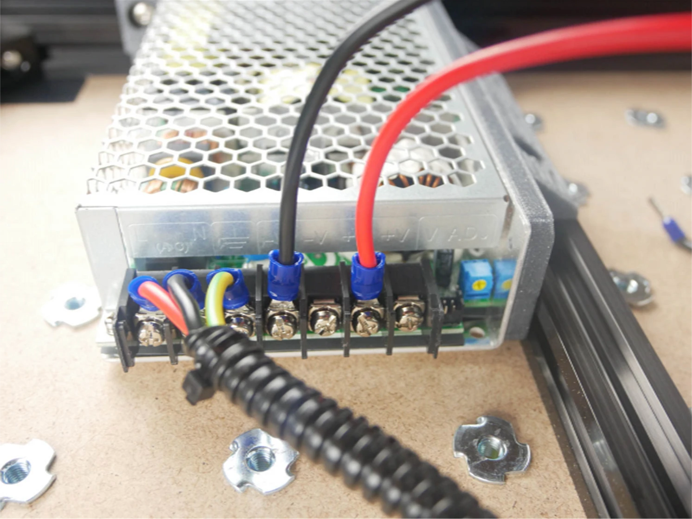
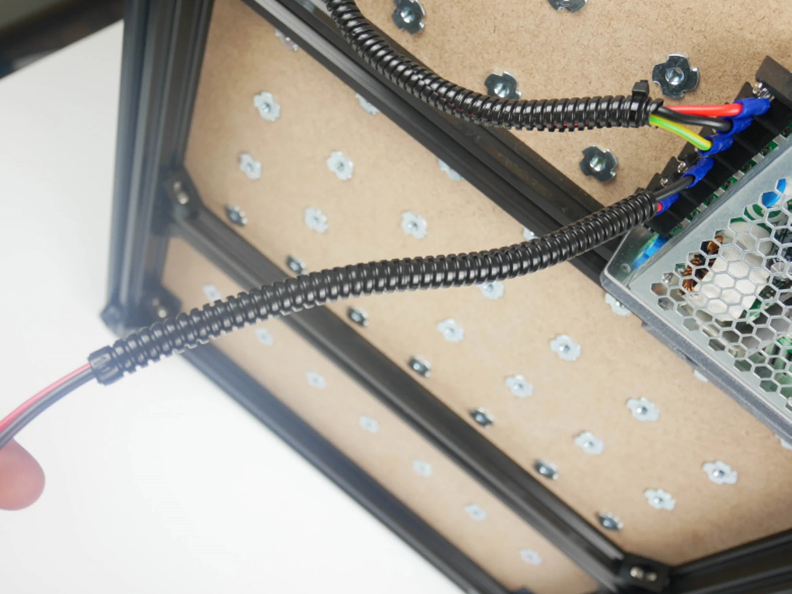
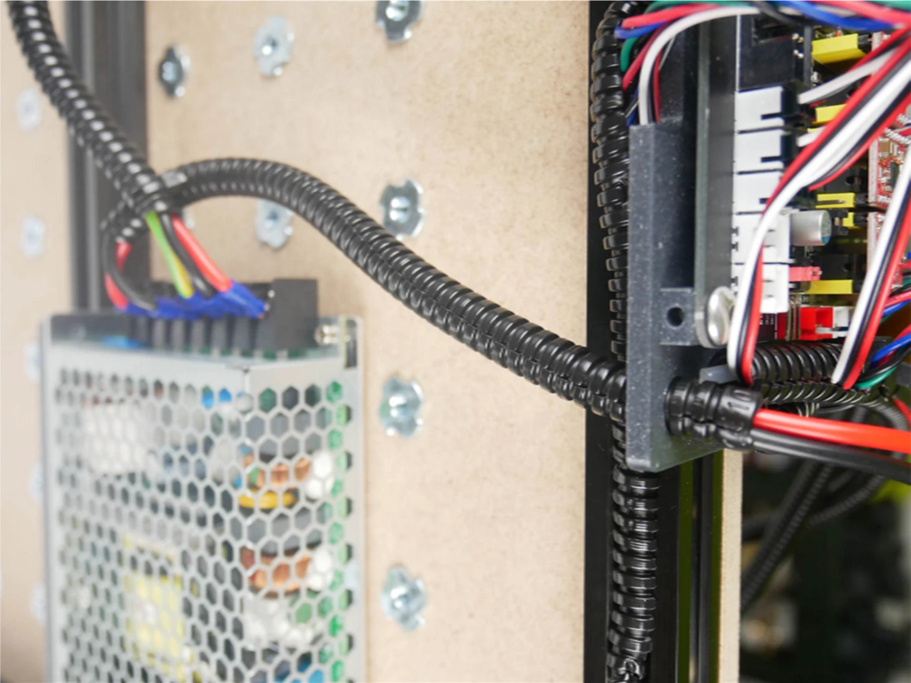
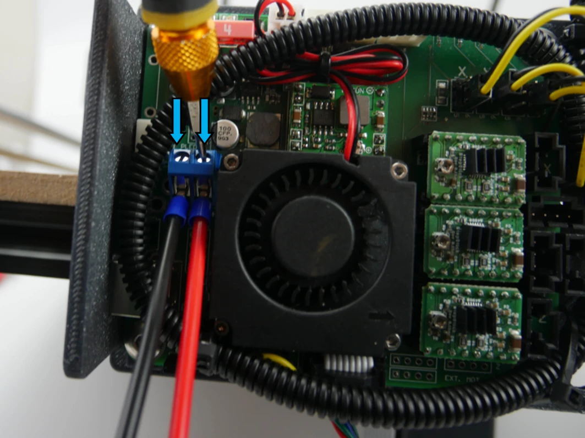
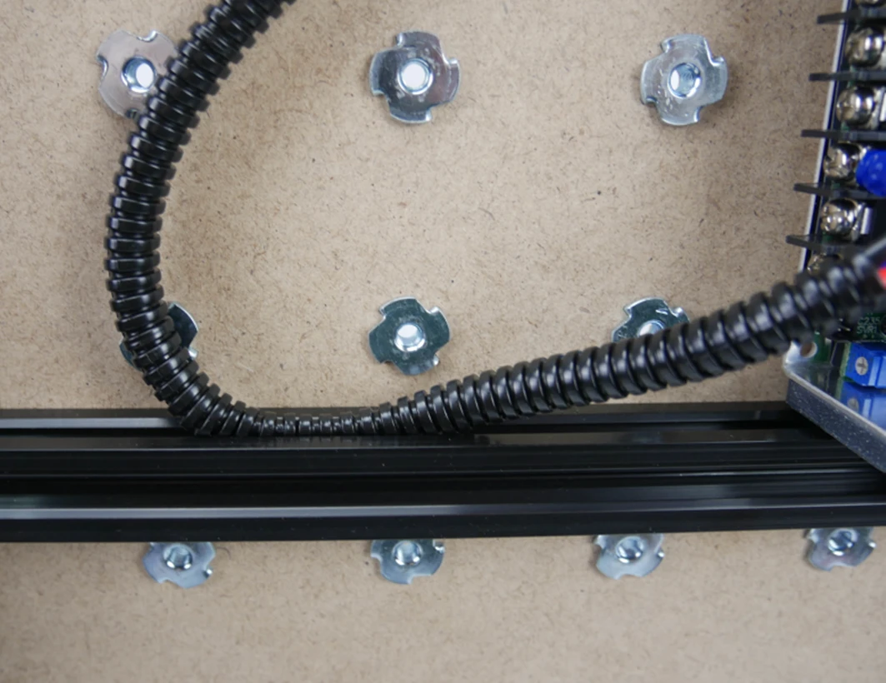
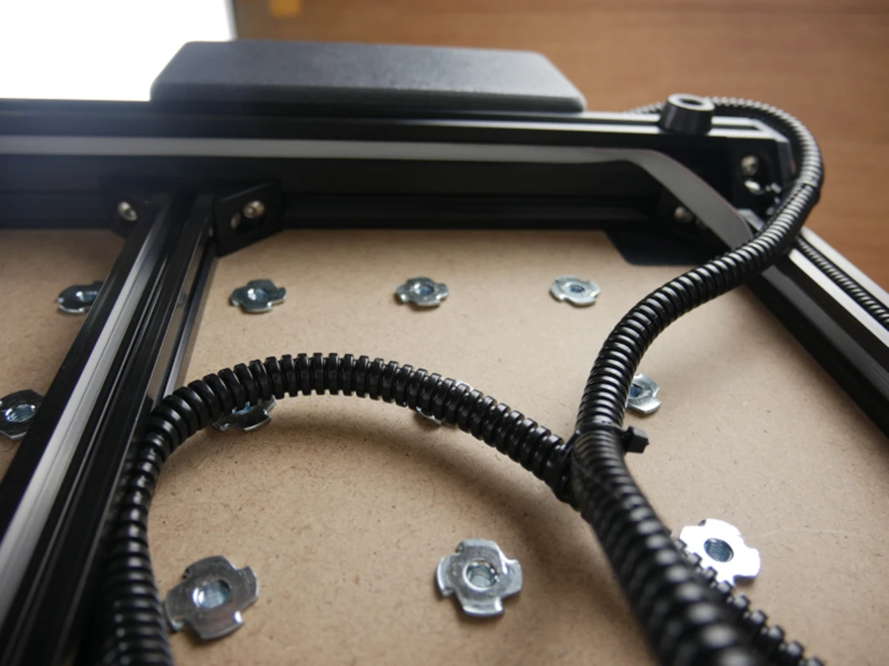

# Krok 12 - Podłączenie zasilania

## Podłączenie zasilania
Przykręć kable zasilające do odpowiednich złączy

## Podłączenie elektroniki
Weź kable zasilające elektronikę i przykręć je do złączy w zasilaczu.

Umieść kable zasilania w peszłu, a następnie przeprowadź kable przez otwór w dolnej części obudowy elektroniki

## Zasilanie wyświetlacza LCD
Przykręć kable zasilające do odpowiednich złączy na elektronice

