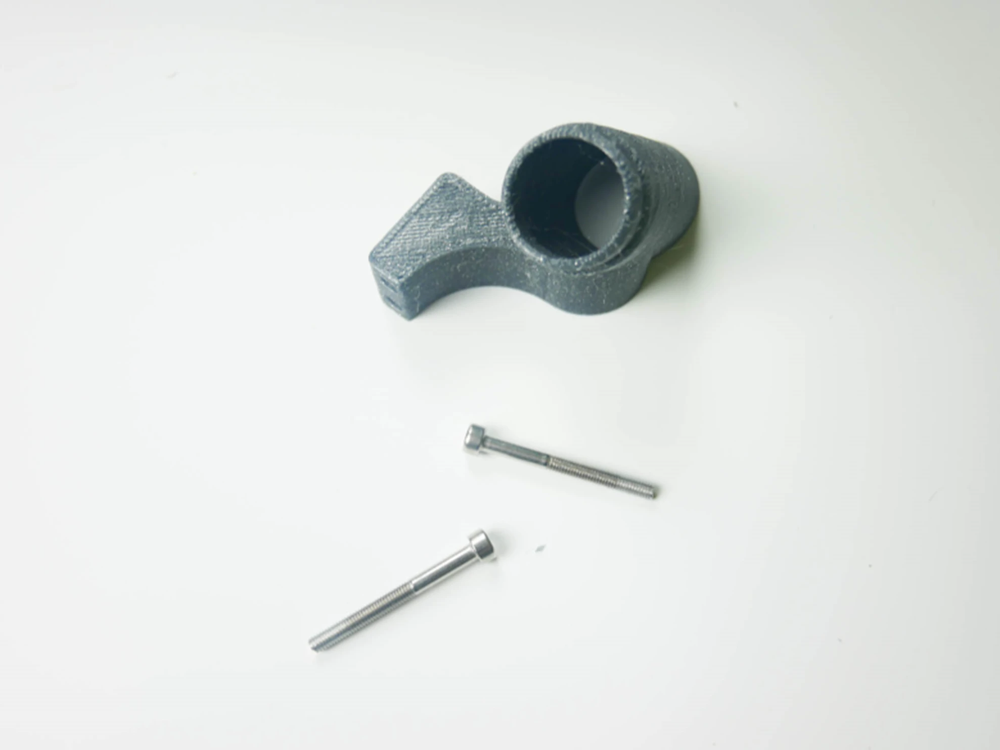
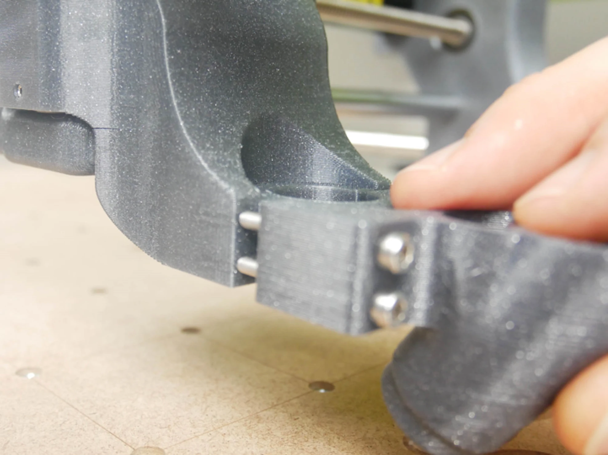
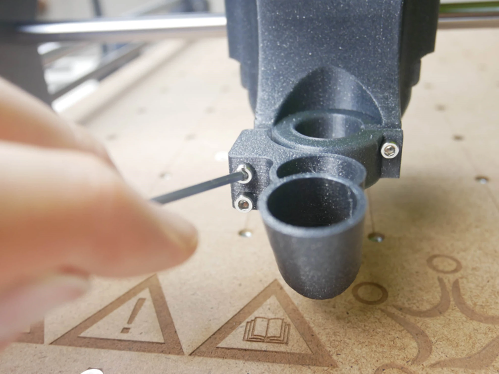
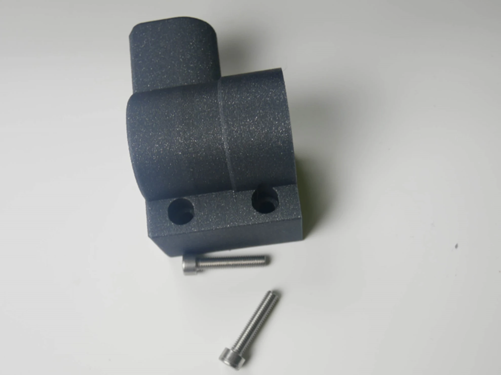
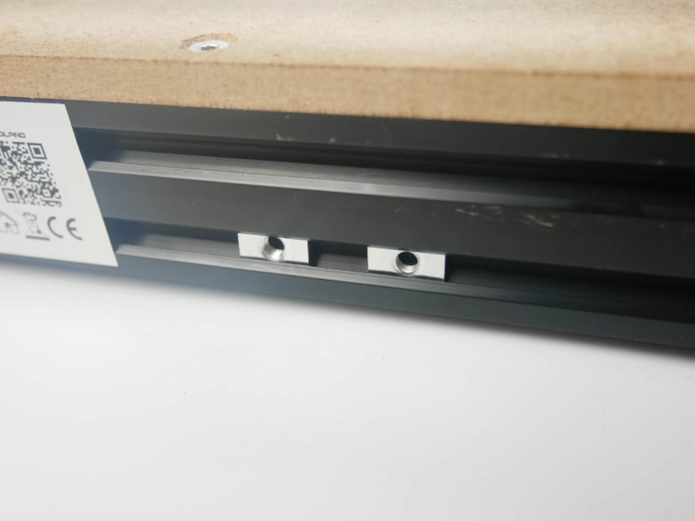
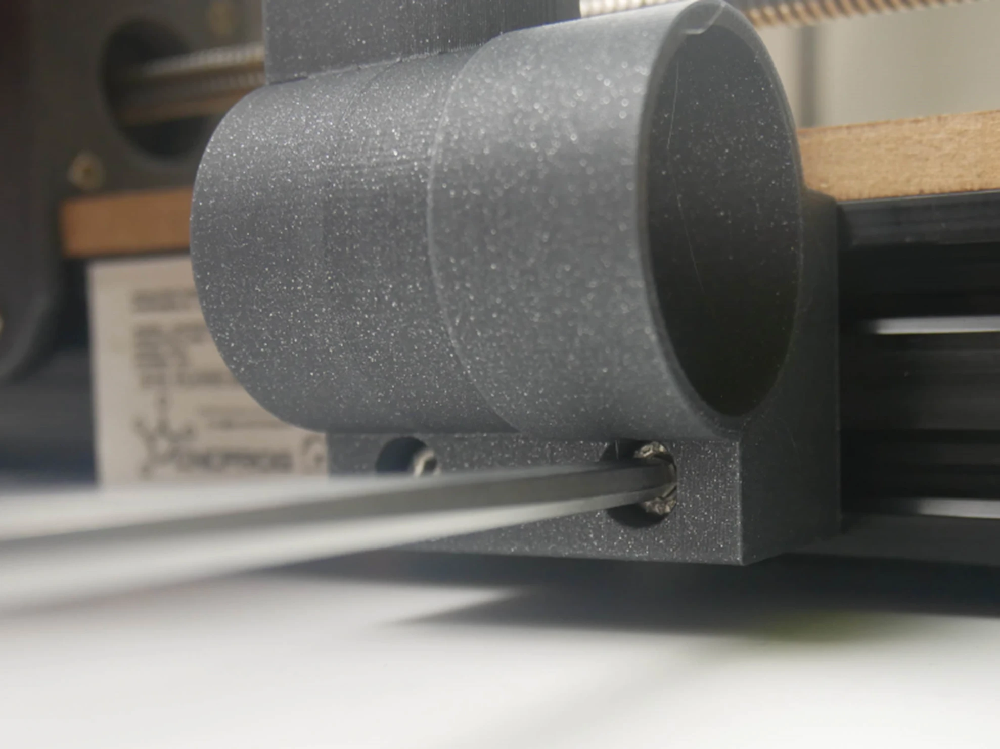
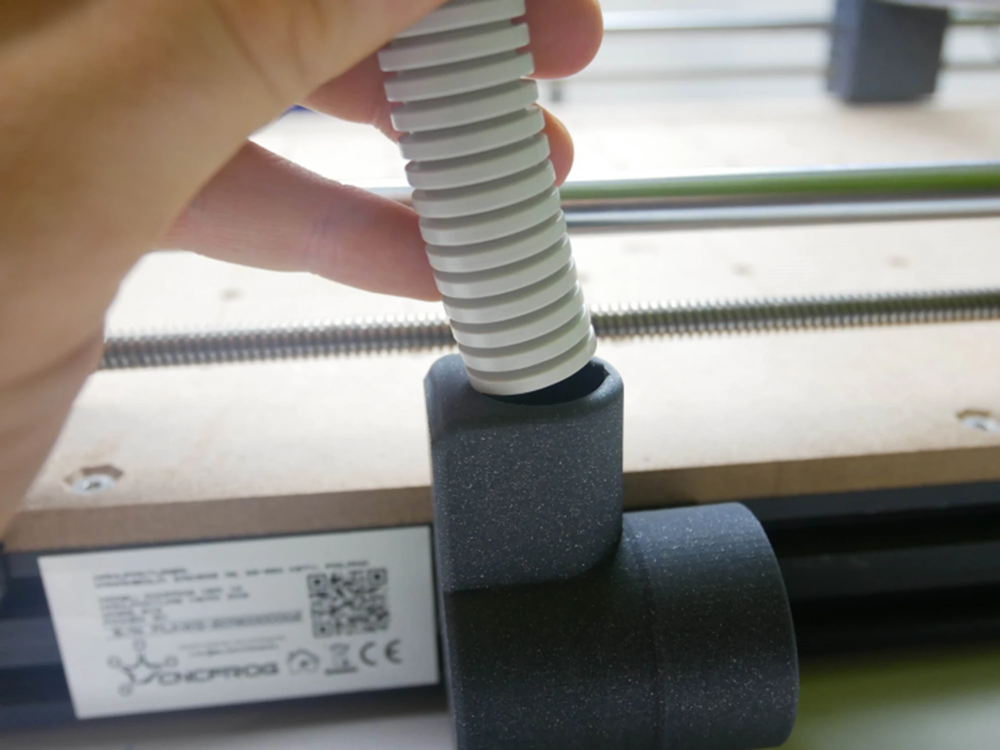
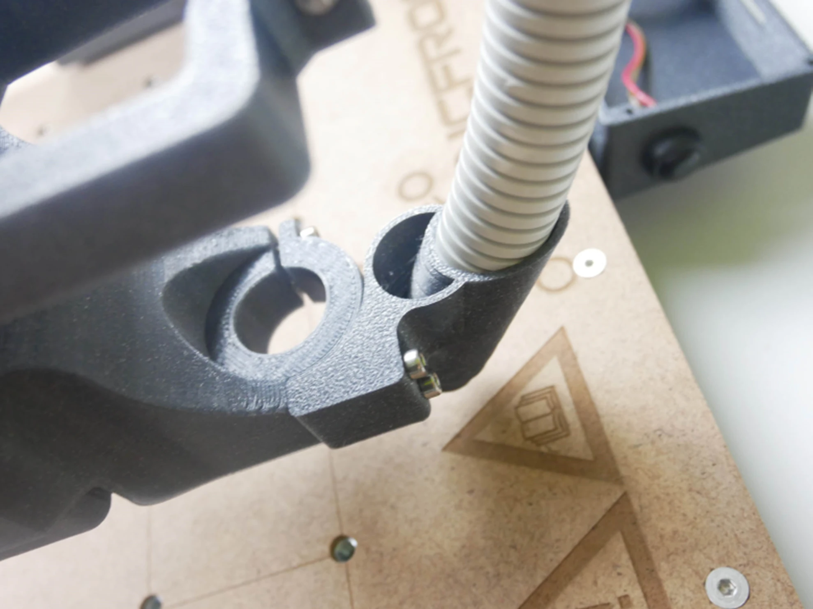

# Step 14 - Vacuum module assembly

!!! info "Required elements"
    - M3x30 screws
    - M5x25 screws

## Vacuum holder installation
Fasten the first part of the vacuum module to the spindle clamp using M3x30 bolt, as well as the second part of the vacuum module to the side extrusion with two M5x25 bolts

Slide the corrugated pipe into both vacuum module components

