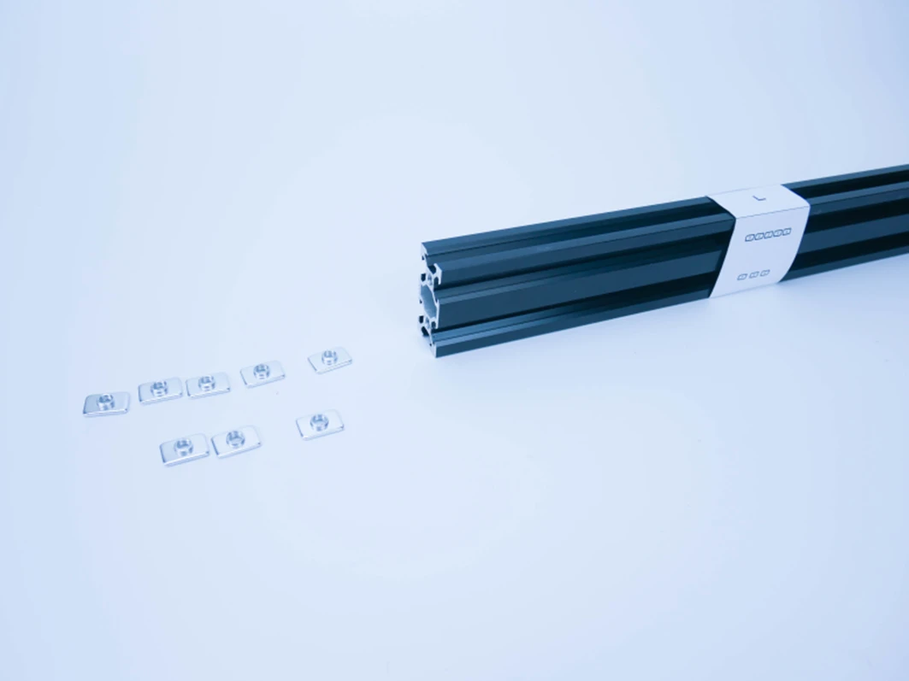
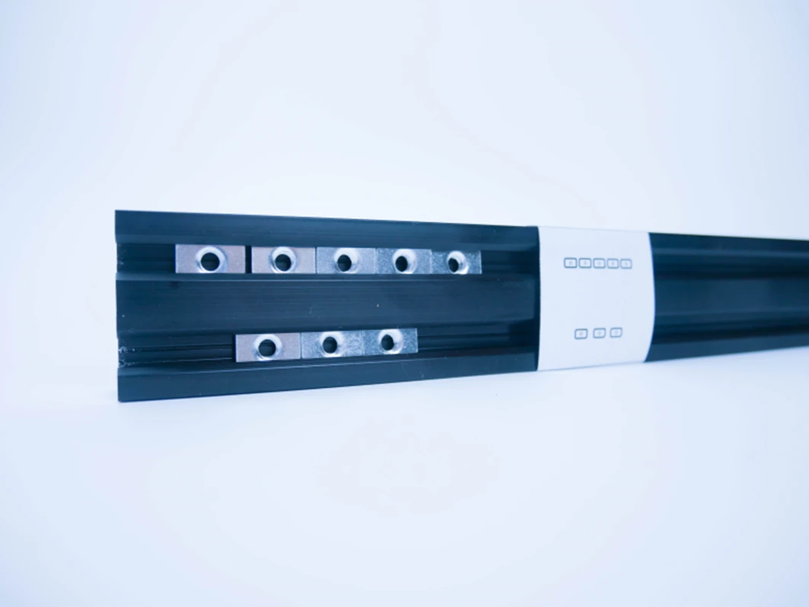
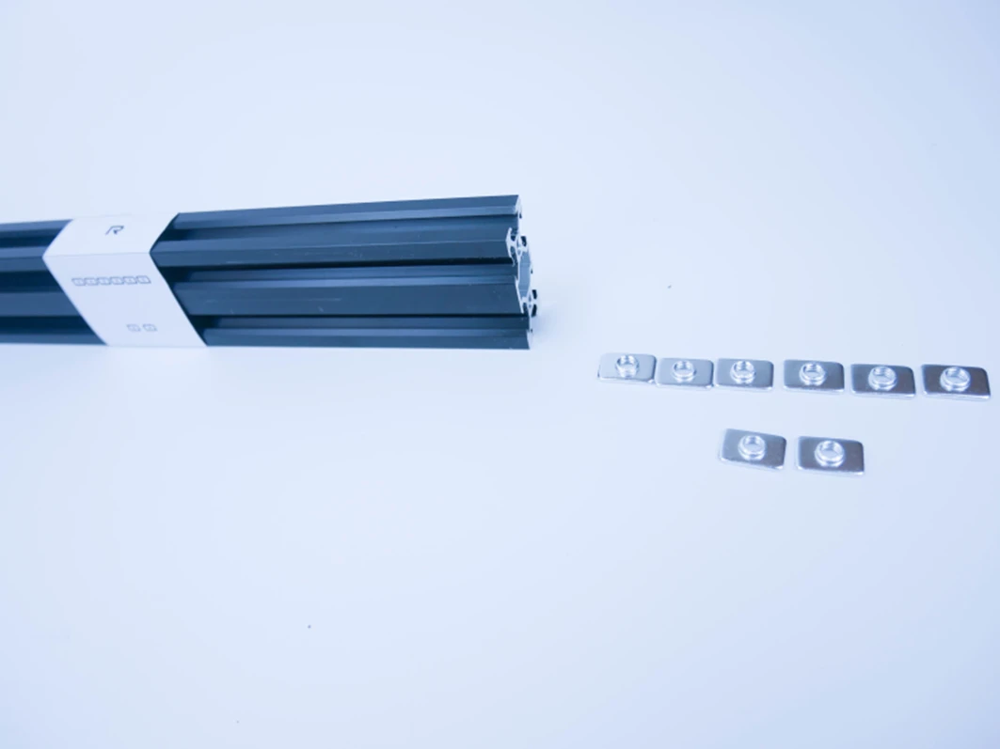
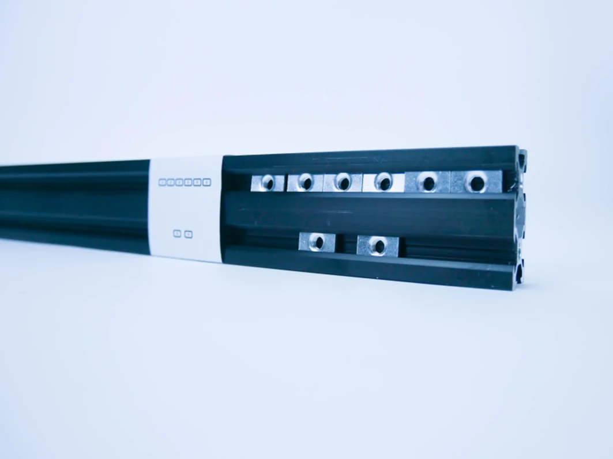

# Profil L i R

W profilach 2040 L i R umieść nakrętki T-nut w taki jak na zdjęciach, korzystaj ze wzorników naklejonych na profilach.

## Profil L

{ loading=lazy }
{ loading=lazy }

## Profil R

{ loading=lazy }
{ loading=lazy }