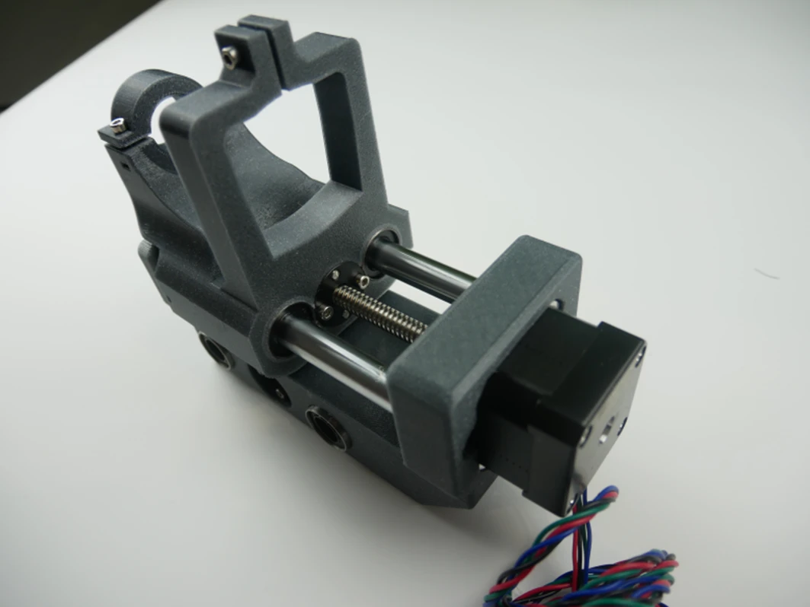

# Step 6 - Z axis - Z module assembly 

!!! info "Required elements"
    - LM12UU bearings
    - M3 grub screws
    - Trapezoid nuts
    - M3x25 nuts
    - M3x10 nuts
    - CX-80 lithium grease
    - Shortest 12mm linear rods
    - Ball bearing 608RS
    - Step motor

## Placement of LM12UU bearings
Take the main Z-axis component and place two LM12UU bearings in each hole. Place the bearings in a way that the ball lines are rotated approximately 45° relative to each other.

!!! note "Make sure"
    To make sure the bearings are rotated by 45 degree take a look at the placement of rolling element (balls) inside of the bearing.

Fasten the bearings with M3 grub screws.

Unscrew the trapezoid nut from the X axis motor screw and place inside the pocket in the Z axis component.

Tighten the nut with four M3x25 bolts.

Take the CX-80 lithium grease, squeeze some inside every bearing and spread across the whole inside surface using an Allen key

## Linear rod instalation
Take two shortest 12 mm linear rods and slide them in the mounting holes inside the Z module by about 40 mm

Place the 608 ball bearing inside the lower pocket

## Spindle clamp assembly
Slide the spindle clamp on the linear rods, then push the rods deeper, so their ends are enclosed completely in lower holes of the Z module.

Check is the spindle clamp can slide smoothly across the whole length of linear rods.

Check if the rod ends are aligned with the surface of the motor mount.

Place the Z-axis step motor inside the pocket and turn the screw until the motor sits properly inside.

Fasten the motor to the Z module using four M3x10 bolt.

