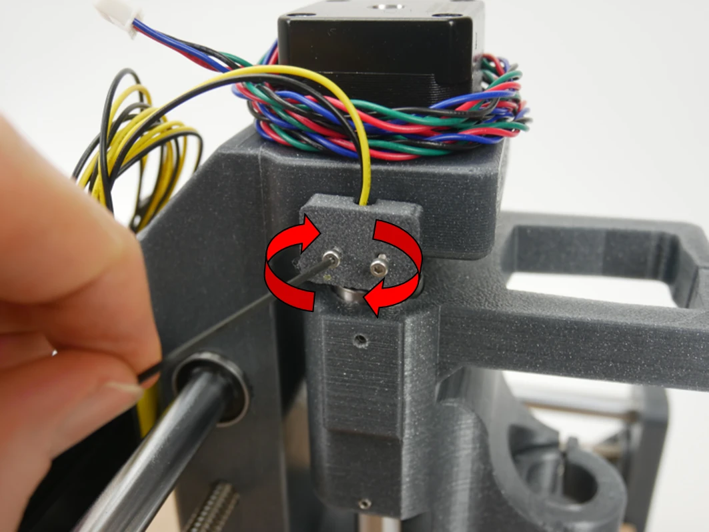
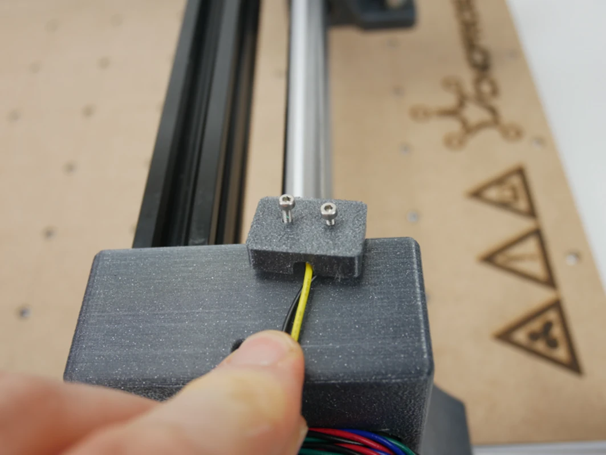
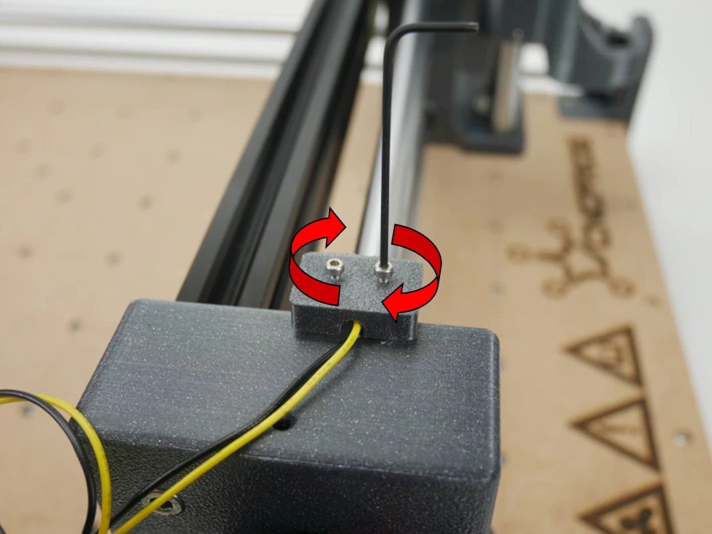
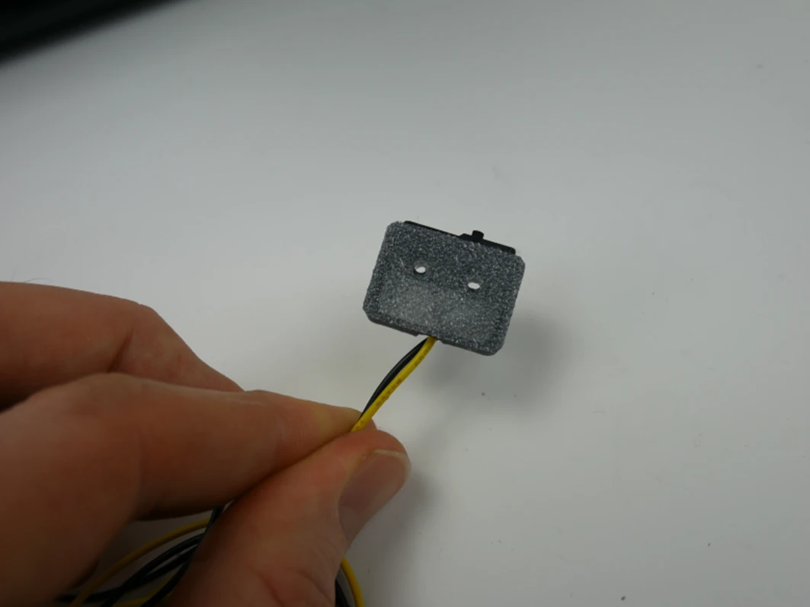
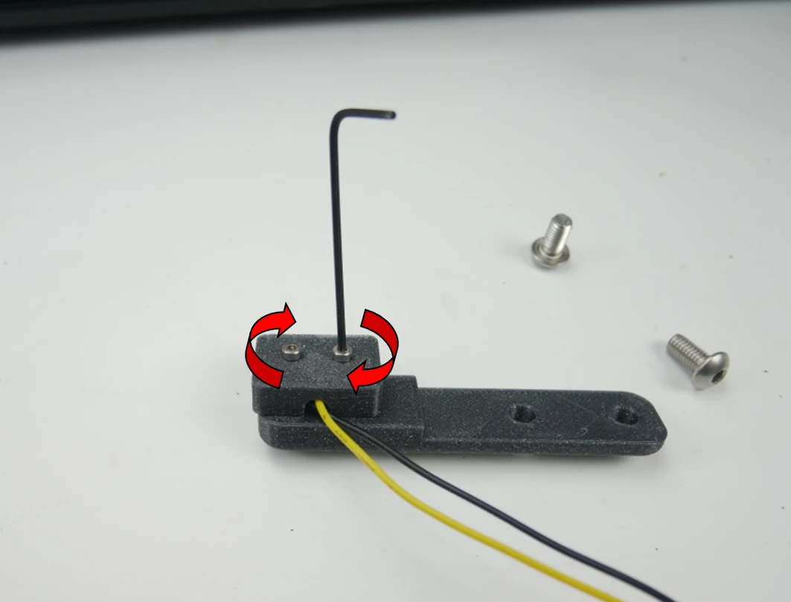
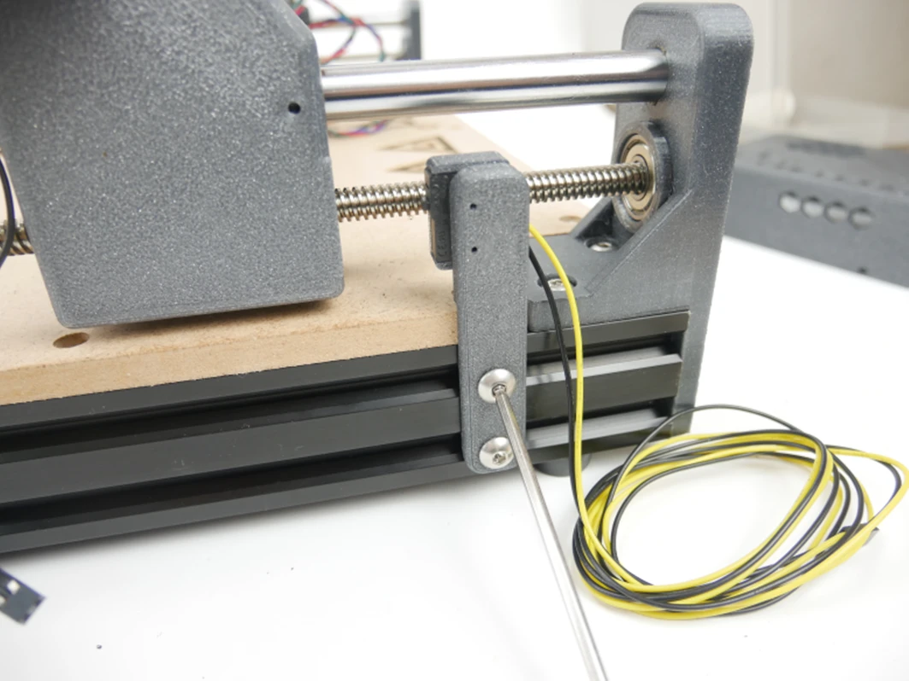
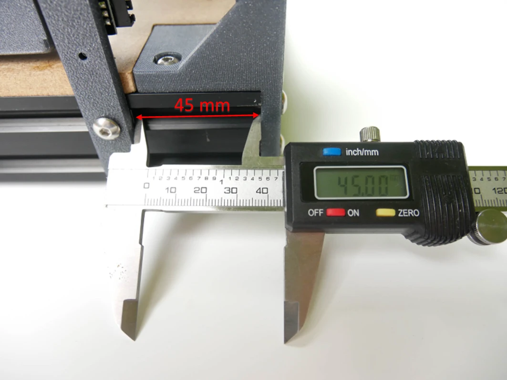

# Step 9 - X/Y/Z - axis endstops assembly

!!! info "Required elements"
    - M3x10 screws
    - M5x8 screws
    - Endstops

## Installation of X and Z endstops
Fasten the X and Z axis endstops to their mounts with M2.5x10 bolts

Fasten the X and Z axis endstops to their mounts with M2.5x10 bolts

## Installation of Y endstop
Position the endstop mount in the distance of 45 mm from the front of the machine and fasten it to the frame using M5x8 bolts

