# Krok 9 - Montaż krańcówek osi X Y Z

!!! info "Potrzebne elementy"
    - Śruby M3x10
    - Śruby M5x8
    - Krańcówki

## Montaż krańcówki X Z
Przykręć śrubami M3x10 krańcówki X i Z do gniazd znajdujących się na części Z i X

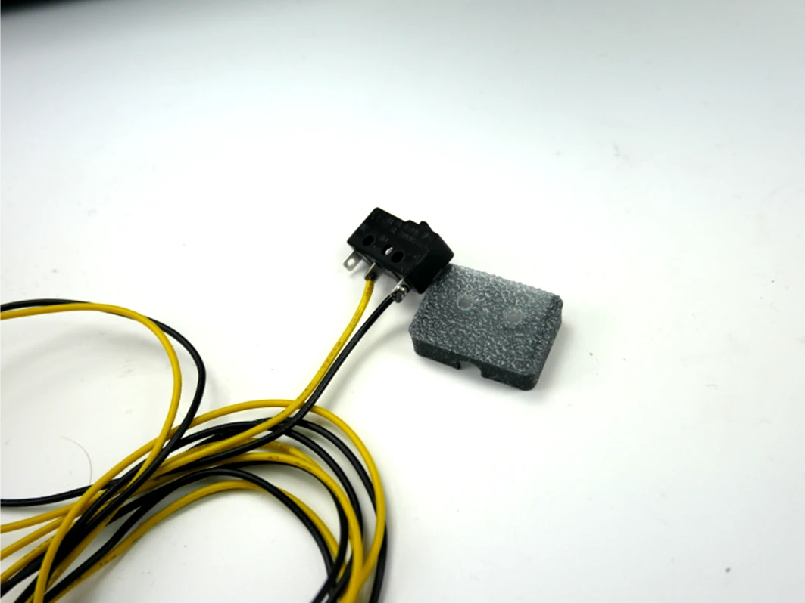
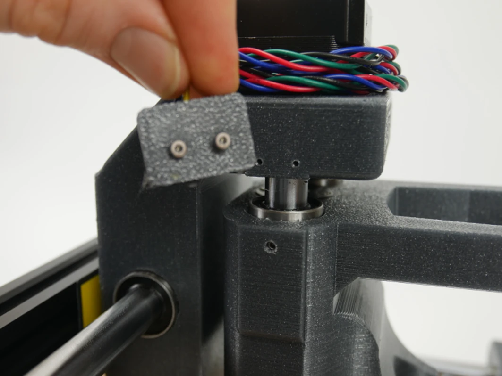
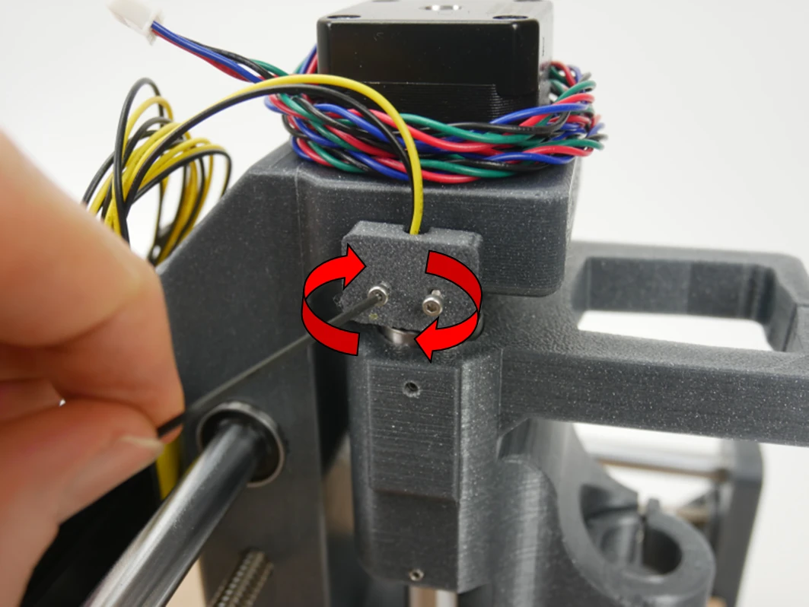
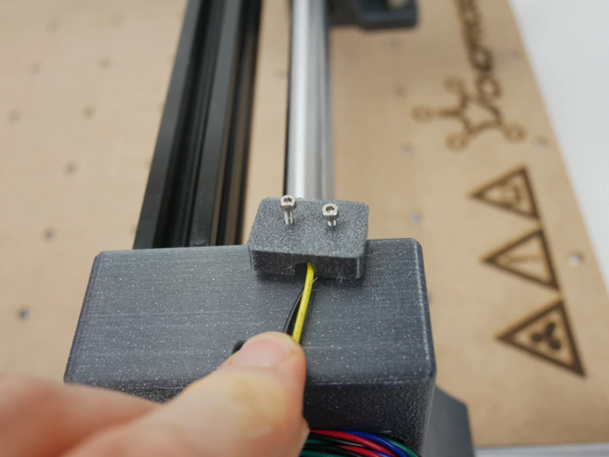
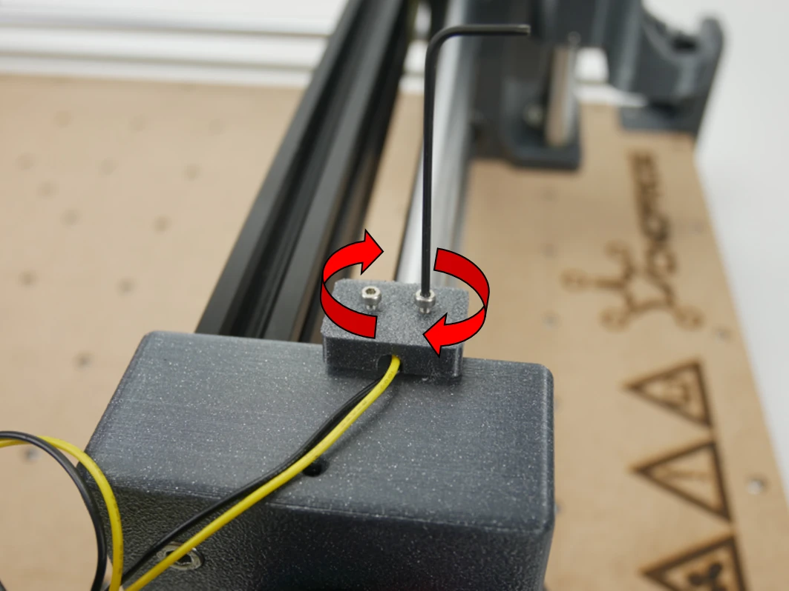

Zamontuj za pomocą śrub M3x10 do uchwytu krańcówki

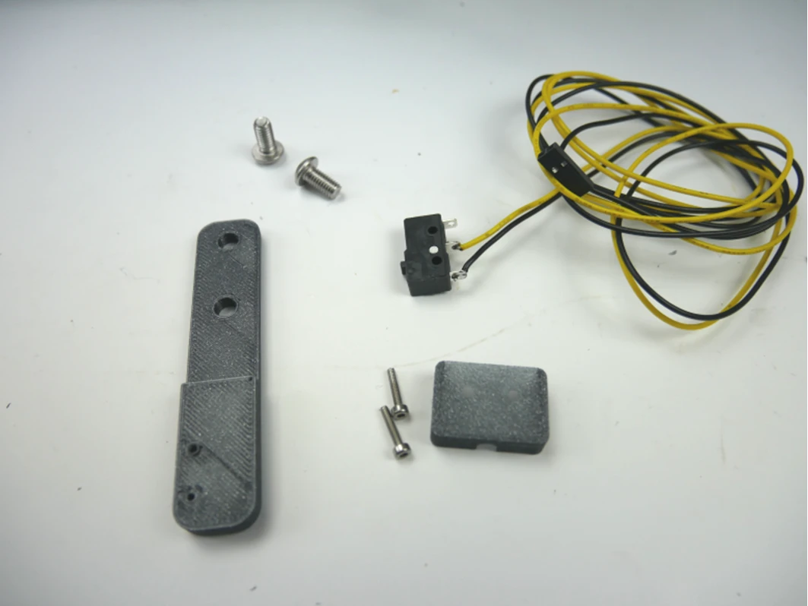
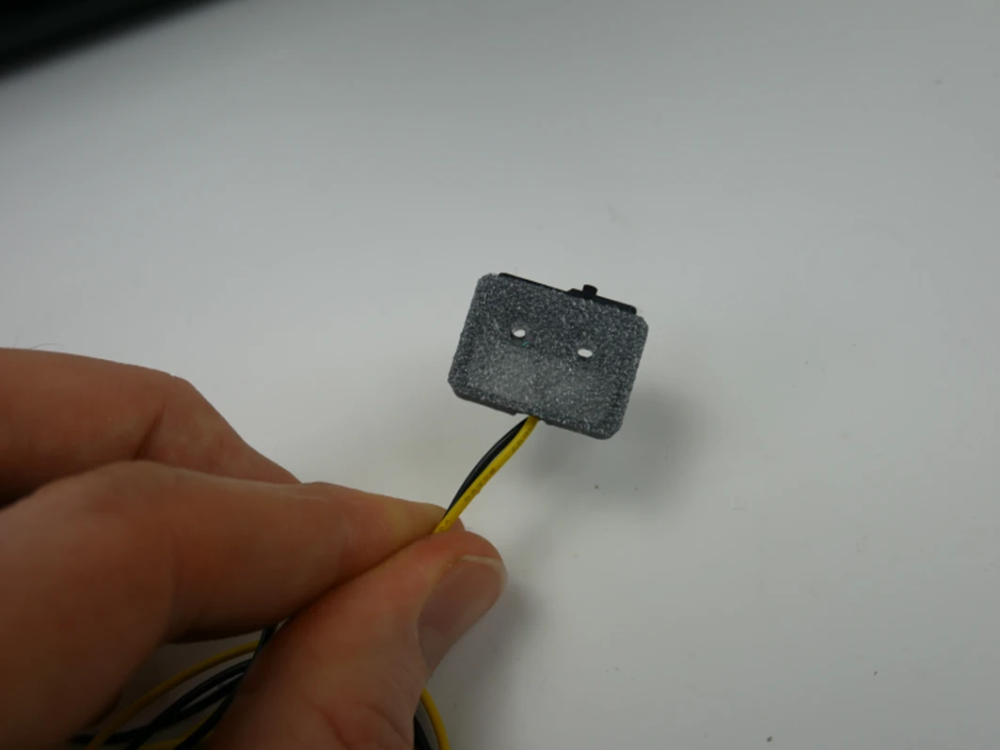
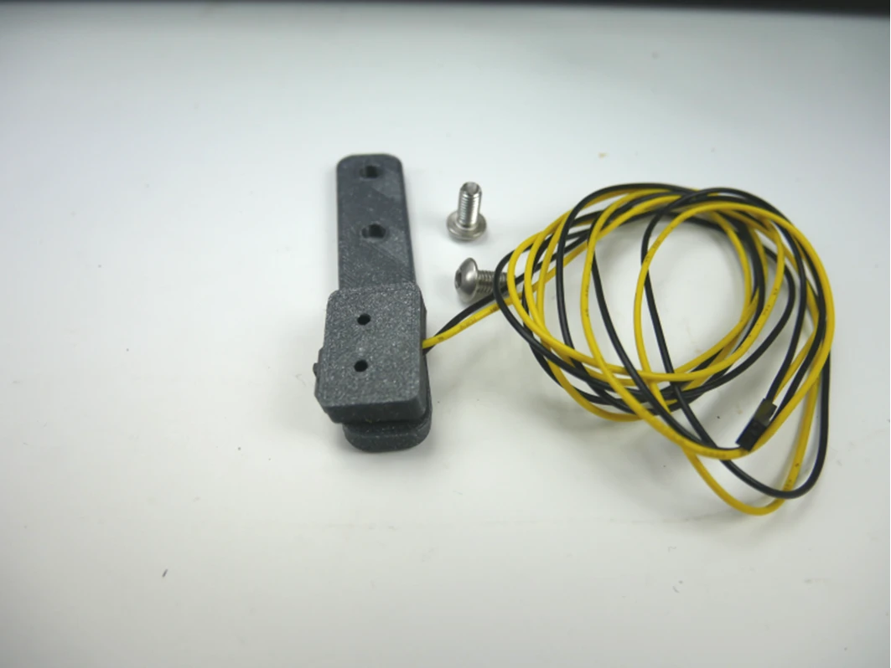
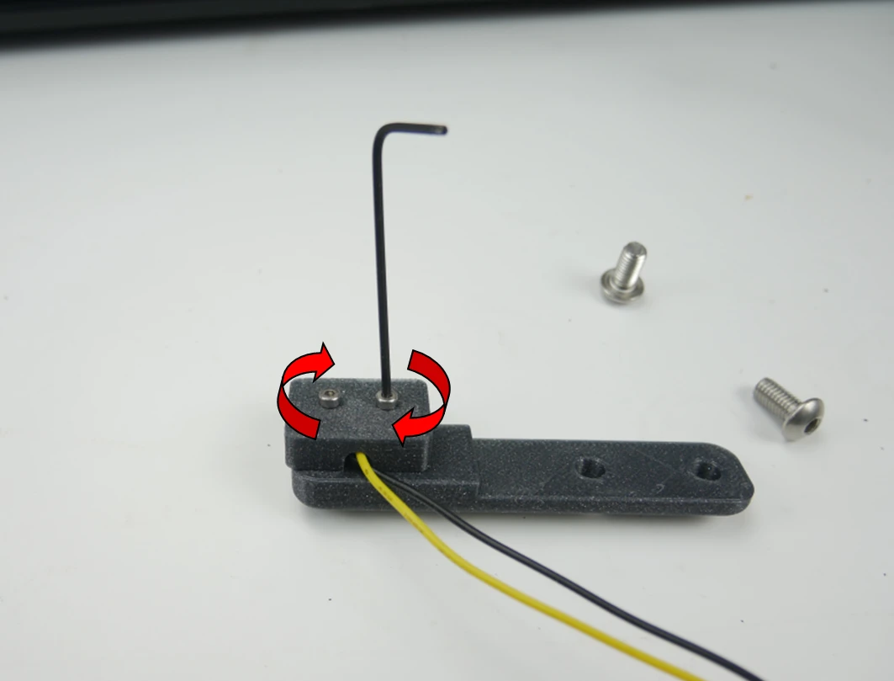

## Montaż krańcówki Y
Przykręć uchwyt krańcówki Y za pomocą śrub M5x8 z przodu ramy frezarki w odległości 45 mm

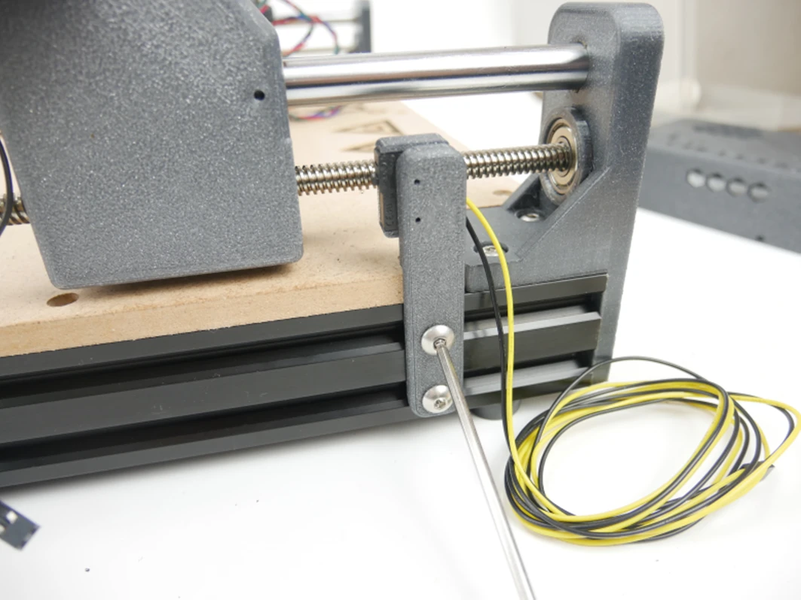
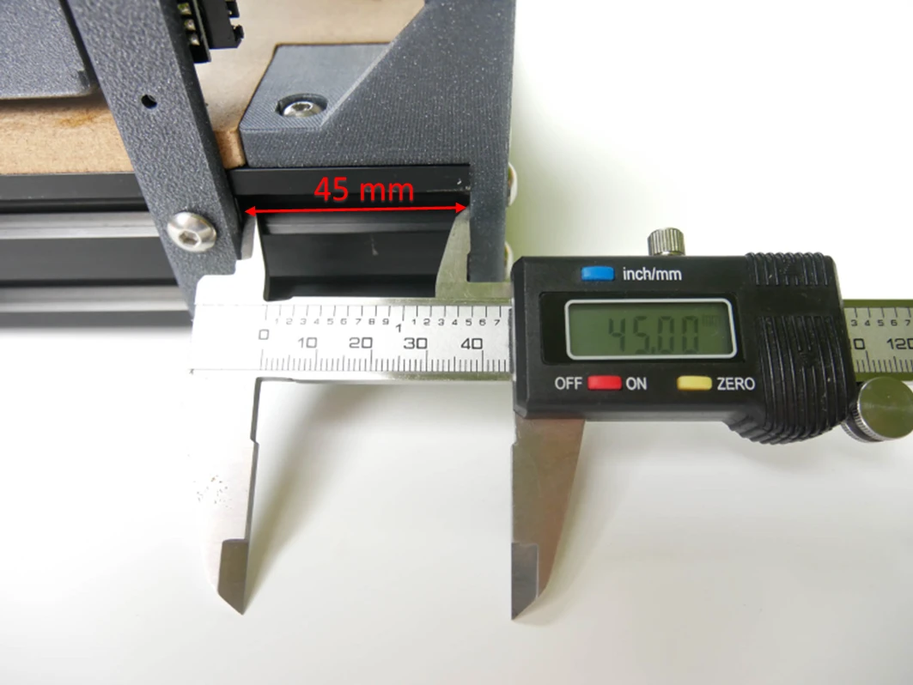
