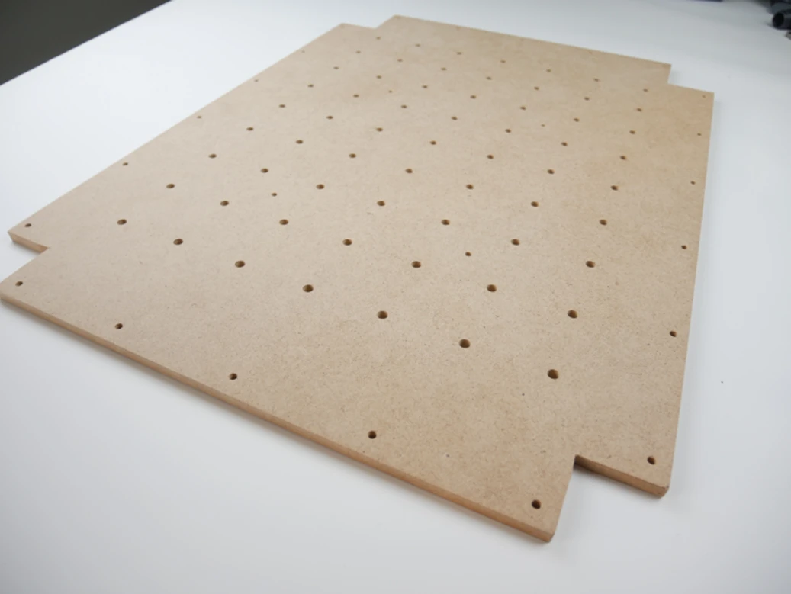
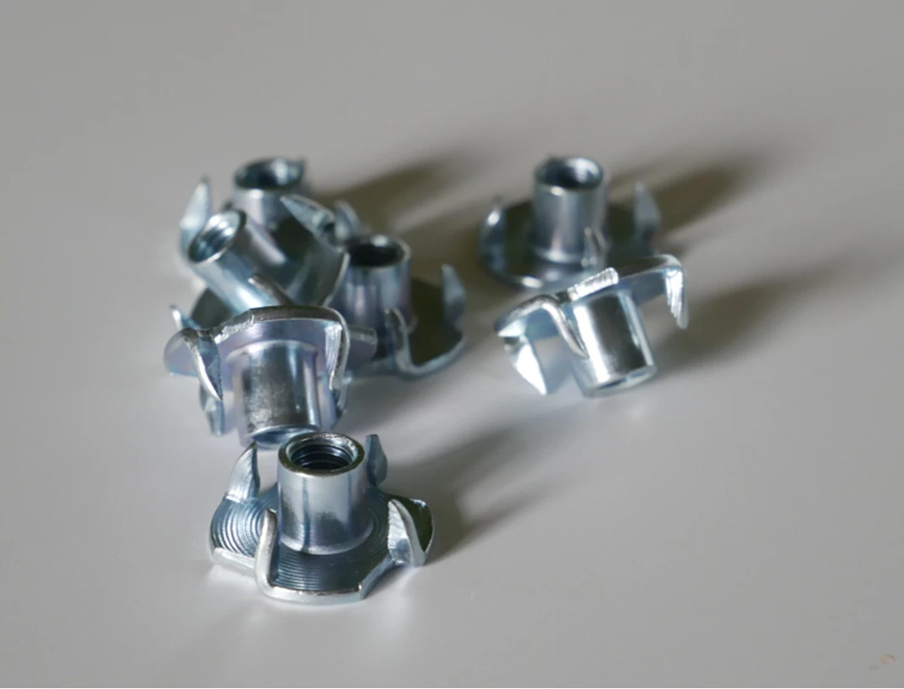
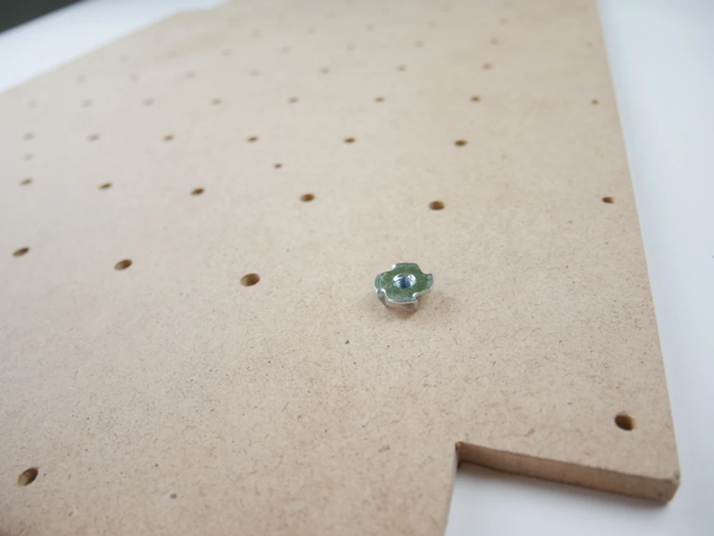
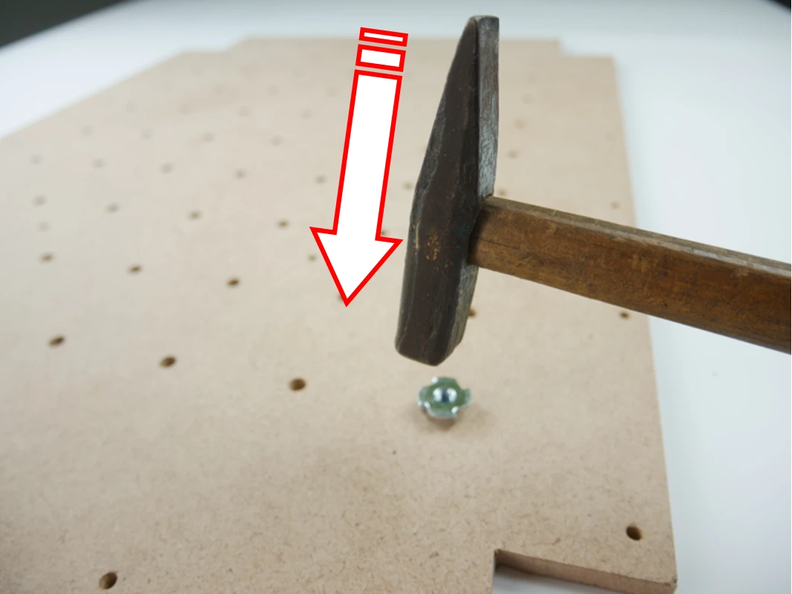
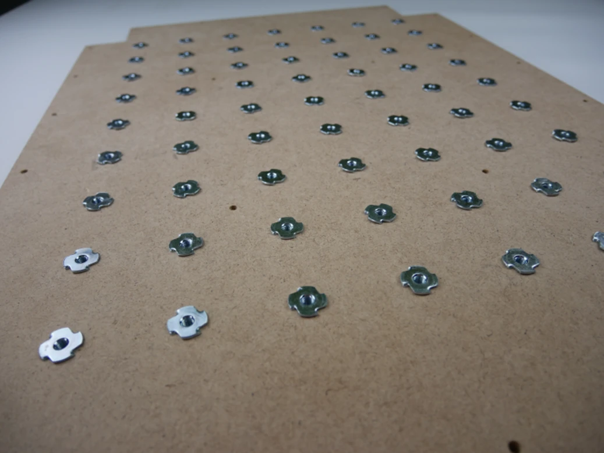

# Krok 1 - Montaż nakrętek pazurkowych w płycie roboczej 

!!! info "Potrzebne elementy"
    - Płyta MDF
    - Nakrętki pazurkowe
    - Młotek

## Montaż

Połóż płytę MDF logiem CNCFrog do dołu

<figure markdown>
{ loading=lazy }
<figcaption>Płyta MDF</figcaption>
</figure>

Odszukaj woreczek oznaczony „CLAW NUTS” z nakrętkami pazurkowymi

<figure markdown>
{ loading=lazy }
<figcaption>Nakrętki pazurkowe</figcaption>
</figure>

Umieść jedną nakrętkę pazurkową z otworze fi 6.5 i wbij ją młotkiem w płytę MDF

<figure markdown>
{ loading=lazy }
</figure>

<figure markdown>
{ loading=lazy }
<figcaption>Sposób montażu</figcaption>
</figure>

W ten sam sposób zamontuj pozostałe nakrętki w płycie

<figure markdown>
{ loading=lazy }
<figcaption>Koniec kroku 1</figcaption>
</figure>