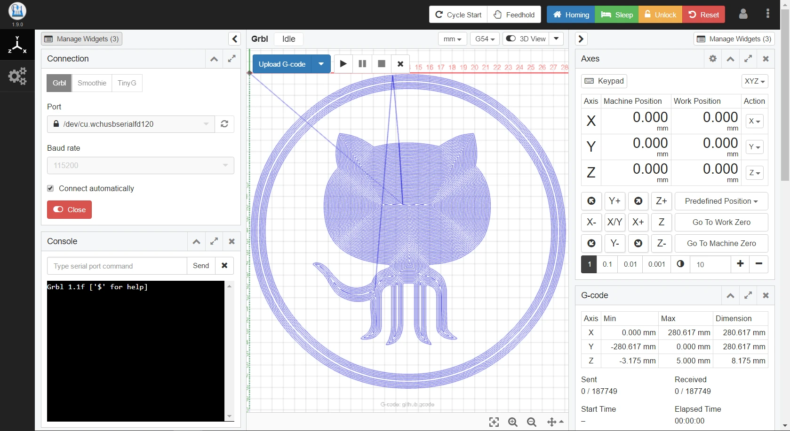

# Introduction

## 1. Details about the product
* Product name: CNCFrog 2639/3144/3649/4055 Milling machine
* Compatible devices (optional): PROXXON IBS/E, Dremel 3000/4000
* Manufacturer: Karambola, Zacisze 112, 32-650 Kęty, Poland
* Contact: phone +48662772277, e-mail: info@cncfrog.pl
* EEE Group: 3 (IT and/or telecommunication equipment)
* Usage: indoors only
* Power supply: 85-264 VAC, 3,6 A / 120-370 VAC, 1,8 A (50-60 Hz)
* Working temperature range: 18 ° C—38 ° C, indoor usage only
* Working humidity: 85% or less
* Weight of DIY kit (gross / net): 9,8 kg / 6,3 kg,
* Weight of assembled machine: (gross / net): 12 kg / 6,3 kg.
* Serial number is placed on the frame of the machine.
  
<figure markdown>

{ width="100", align=left }
{ width="200", align=right }

</figure>

## 2. Disclaimer

!!! Danger "Read the instructions!"
    Not complying to the manual might cause injuries, loss of quality or damage to the machine. Always make sure that __the person operating is trained and knowledgeable of the device.__ We are not able to monitor the assembly conditions, thus the accurate and careful assembly lies within you responsibility.

__For this and other reasons, we expressly state that we are not responsible and do not accept claims for losses, injuries, damages or expenses resulting from or in any way related to the assembly, handling, storage, use or disposal of the product and its use against its intended purpose.__ The information contained in this manual are provided without any warranty, expressed or implied, regarding its correctness.

## 3. Safety instructions

!!! Danger "Warning!"
    { width="120", align=right }
     Proceed with extreme caution when operating the milling machine. It is is an electrical device with moving parts.

1. This device is intended for use only indoors. Do not expose it to elements, like rain or snow. Always keep the device in dry environment, located at least 30 cm from other items.
2. Always place the milling machine on a stable, sturdy surface and make sure it is not able to fall or tip over.
3. The milling machine’s supply is household power outlet 230 VAC, 50 Hz or 110 VAC / 60 Hz; Never connect the device to a different power supply, as it may cause malfunction or damage.
4. Place the power cord in a way that you can’t stumble on it, step on it or otherwise expose to any damage. Make sure the power cord is not damaged mechanically or in any other way. In case of cable damage stop using it immediately and replace it.
5. When disconnecting the power cord from the socket, pull the plug rather than the cord to reduce the risk of damage to the plug or AC outlet.
6. Never disassemble the machine’s power supply, as it does not contain any parts that could be repaired by an untrained operator. All repairs must be performed by a qualified technician.
7. Do not touch the cutter while the machine is running. Remember that moving parts could cause injuries.
8. __Prevent underaged from unsupervised access to the device even when it is not running — minors should use the machine only under supervision of an adult!__
9. __Do not leave the milling machine unattended while it's on!__
10. The process of milling produces chips, dust and other pollution, so keep the area around the machine clean. Use a vacuum cleaner to minimize the spread of dust and chips and cumulation of those on machine’s moving parts. Failing to do so may lead to its damage.

## 4. Power multi-tools compatible with CNCFrog.

CNCFrog milling machine is compatible with the following power tools:

* Proxxon IBS/E drill/grinder
* Proxxon IBS/A drill/grinder
* DREMEL® 3000 (3000-15) multi-tool
* DREMEL® 4000 multi-tool
* Air–cooled spindle rated at max. 500W and 52 mm mounting grip diameter
* All of working parameters and conditions for compatible cutters, grinding stones, drill bits etc. are to be found in your mult-tool’s manual.

## 5. Application of CNCFrog milling machine

CNCFrog will help you create a real object based on a digital model. Using an appropriate modeling software, e.g. open source Inkscape or CAD package (AutoCAD, Inventor, Fusion 360 etc.) you’ll be able to create a model and CNCJS [(https://cnc.js.org)](https://cnc.js.org) software will send it to the milling machine running the GRBL firmware, which will then cut the desired object based on GCODE.

Using the CNCFrog you will be able to precisely and efficiently create parts as often as you need it. Supported materials are virtually limitless: CNCFrog and optional accessories can handle materials such as wood, thermoplastics (PS (polystyrene, such as Styrofoam®, EPS, Depron ®, Selitron ®), ABS, PE (polyethylene), PP (polypropylene, e.g. PPE) soft / hard PVC, Lexan ®,polyamide, acrylic glass ®), some elastomers / thermosets, composite materials, such as DIBOND, and even carbon and non-ferrous metals (aluminum, brass or copper). Every of those materials needs the appropriate set of tools.

## 6. Assembling the milling machine Self-assembly kit (DIY)

CNCFrog is supplied as a set of parts for self-assembly, which takes a few hours with the included assembly manual. The manual is prepared in a way to minimize issues. It will lead you step by step and show how to set up parts with each other. You will use just a few basic tools. The device is delivered with all the necessary equipment: all mechanical and electronic components, power supplies and cables are included.

During the assembly of the milling machine please follow the assembly manual available online: [http://cncfrog.pl/](http://cncfrog.pl/) or in the next chapters of this document.

## 7. Quick configuration before the first start and milling

* Place the milling machine on a stable, horizontal surface. The best is a sturdy workbench that does not bend.
* Make sure that the machine is in the distance of at least 30 cm on each side from other devices.
* Check if the X axis is perpendicular to the Y axis.
* Check if the emergency stop button (red mushroom cap) is in the “ON” position.
* Insert a spindle in the clamp and fasten the screws to mount it securely.
* Connect the spindle to the socket located to the right of the emergency stop button.
* Check if the correct AC voltage is set (110 V / 220 V), connect the power cord to the AC socket and toggle the switch located on the electronics housing.

## 8. Offline use and software 

CNCFrog milling machine is equipped with a controller with an LCD screen, which you can use to move the axes or launch a G-code file from a microSD card. The card contains a test file (a ready G-code), which you can run and test the machine.

Of course there is also a way to control the device using a PC, after connecting both with a USB cable. CNCFrog runs a popular GRBL firmware [(https://github.com/grbl/grbl)](https://github.com/grbl/grbl), which has great capabilities and has an open source.

We recommend using the CNCJS software [(https://cnc.js.org/)](https://cnc.js.org/) to control the machine — it is completely free and very advanced while being quite intuitive.

<figure markdown>
{ loading=lazy }
<figcaption>cnc.js</figcaption>
</figure>

## 9. Terms of warranty

1. A warranty is given for the functional use of the brand new device for a period of 24 months for end customers (12 months for businesses) in the EU.

2. The warranty period begins on the day of delivery of the device to the customer.

3. Defects revealed during the warranty period will be removed free of charge within 14 business days from the date of delivery of the device to the vendor.

4. The product must be delivered to the point of sales in order to perform a warranty repair. After the repair the product will be shipped back to the claimant at the expense of the warrantor.

5. Securing the device in the package in order to protect it from damage during shipping lies within claimant’s responsibility.

6. Claimant is responsible for the loss of the device during shipping to the warrantor, the warrantor undertakes to deliver the repaired device to the claimant and is responsible for the loss of the device when shipping back to the claimant.

7. During the warranty period, the defective equipment will be repaired free of charge by the warrantor or replaced for the same, free from defects. If the repair or replacement is impossible, the claimant has the right to a refund of the amount paid or to choose another equipment with similar value and specifications. Any monetary difference will be paid by the warrantor or the claimant, depending on the cost of the item chosen by the claimant.

8. This warranty covers equipment failures during correct operation or due to manufacturing defects and does not apply to consumables or other additional equipment.

9. The warranty does not cover defects resulting from:

    * Unauthorized repairs, modifications or constructional changes made by the user or other unauthorized personnel.
    * Mechanical, thermal, chemical or intentional damage to the equipment.
    * Storage and maintenance of the device and other damage caused by the user.
    * A decrease in quality due to wear process occurring naturally, e.g. abrasion of the outer shell, scratches, cracks, etc.
    * Damage resulting from a failure to follow the rules of proper operation, as well as using the equipment contrary to its intended use.

10. The warranty of the self-assembly kit (DIY) covers individual parts, not the entire device. 
11. The warranty __does not exclude, limit or suspend__ the customer’s rights arising from the provisions on warranty for defects of goods sold.
