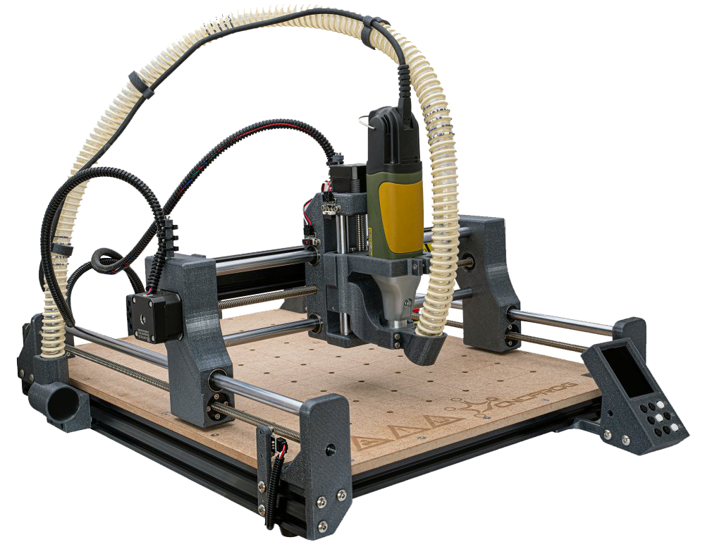

# Instrukcja użytkownika frezarek
- CNCFrog S
- CNCFrog M
- CNCFrog L
- CNCFrog XL

!!! danger
    Ostrożnie, do złożenia tej frezarki __MUSISZ__ wiedzieć jak posługiwać się śrubokrętem!

<figure markdown>
  { Width="500" }
  <figcaption>Złożony produkt</figcaption>
</figure>
